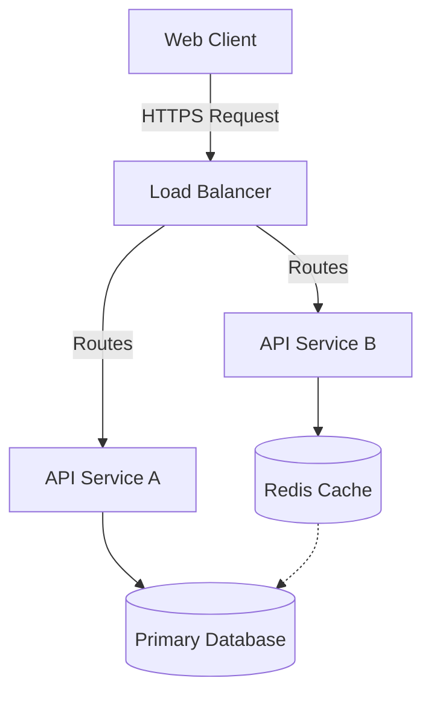

## Problem Statement & Constraints

Describe the core business problem being solved. What are the constraints (time, budget, technology, legacy systems)? Define the baseline metrics before your intervention, and what defined a successful project.

> [!NOTE]
> Add context on why the existing solutions were not adequate and required a custom architecture.

## Architecture Design

Provide a detailed overview of the system architecture. Explain how the major components interact. 

Detail the data flow, the boundary definitions for the microservices/modules, and how state is managed across the stack.

## Technical Trade-offs

Discuss the engineering compromises made during development. For example:
- **Database Selection:** Why SQL over NoSQL?
- **State Management:** Why Context API instead of Redux?
- **Rendering:** SSR vs CSR?

Explain the rationale behind these decisions and why the chosen path was the most optimal for this specific context.

## Performance & Metrics

Outline the quantifiable impact of the project or architecture:
- Core Web Vitals improvements.
- Reduction in API response times or database query execution times.
- Scalability (how many requests/sec handled before and after).

> [!TIP]
> Include exact metrics when possible to strengthen the validity of the case study.
