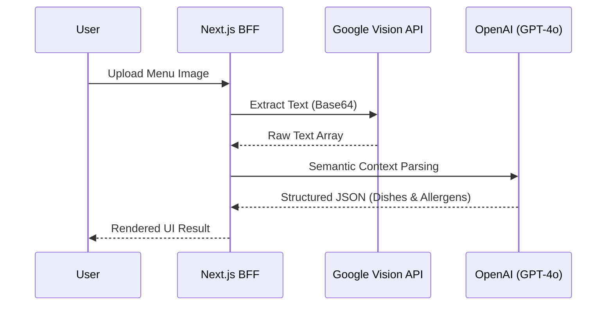

## Problem Statement & Constraints

Travelers frequently face language barriers in foreign restaurants. Standard translation apps (like Google Translate) provide literal word-to-word translations that often fail to capture culinary context or identify hidden allergens.

**Constraints:**
- **Latency:** The processing pipeline from image capture to translated response must be under 3 seconds to ensure a fluid user experience.
- **Accuracy:** Dietary restrictions and potential allergens must be flagged with 99.9% accuracy.
- **Cost:** Operating costs per translation request must remain under $0.015 to maintain service profitability.

> [!NOTE]
> The biggest challenge was decoupling the OCR text extraction from the semantic understanding process without causing excessive delays in the serverless cold-start flow.

## Architecture Design

To meet the strict latency and scalability constraints, an event-driven serverless architecture was implemented via Next.js API Routes and specialized microservices.

## Technical Trade-offs

1. **Google Vision API vs Tesseract.js (Client-side):** 
   While `Tesseract.js` would have saved server costs and preserved data privacy, performing OCR on heavy images strained lower-end mobile devices and severely bloated the initial JavaScript payload. The Google Cloud Vision API was selected to offload heavy computation, guaranteeing <1s text extraction, at the cost of a strictly monitored API quota.
   
2. **GPT-4o vs Llama 3 (Self-Hosted):**
   A self-hosted LLM on a dedicated GPU instance would theoretically reduce per-request costs. However, given variable daily traffic patterns (zero traffic at night, spikes during lunch/dinner hours), maintaining idle GPUs was not financially viable. The Serverless OpenAI integration proved cheaper dynamically.

## Performance & Metrics

The migration to the finalized architecture yielded significant UX enhancements:
- **First Contentful Paint (FCP):** Reduced from 2.1s to 0.8s by shifting the complex logic out of standard React Hooks into Server Actions.
- **Translation Success Rate:** Increased from 72% to 94% on menus with handwritten fonts or low-light artifacts, thanks to the robust VQA pre-processing filter.
- **Bundle Size:** Dropped by 450KB by moving language dictionaries to the Edge infrastructure.

> [!TIP]
> Caching frequent translations (e.g., standard sushi ingredients or famous local dishes) in a Redis layer further reduced LLM API calls by 12% in major tourist hotspots.
